### Descrierea lucrării individuale:
Proiectul constă în analiza cererilor HTTP printr-un set de cerințe și sarcini care implică utilizarea metodei POST, GET, PUT, și DELETE pentru a interacționa cu serverul la diverse adrese.

### Lista surselor utilizate:
1. MDN Web Docs
2. CURL Documentation

### Sarcina nr. 1. Analiza cererilor HTTP
1. Accesam site-ul http://sandbox.usm.md/login
> 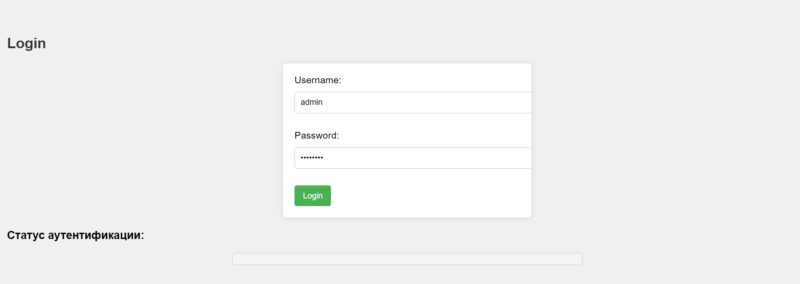

2. Deschidem fila Network în instrumentele pentru dezvoltatori ale browserului. 
> 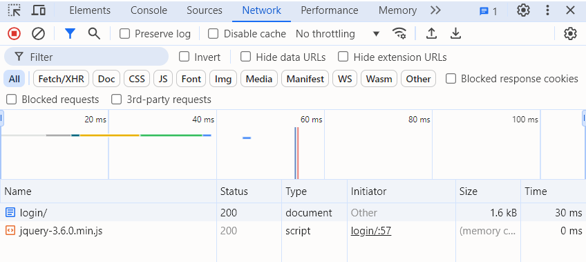

3. Introducem datele incorecte pentru autentificare (de exemplu, username: student,
password: studentpass).
> 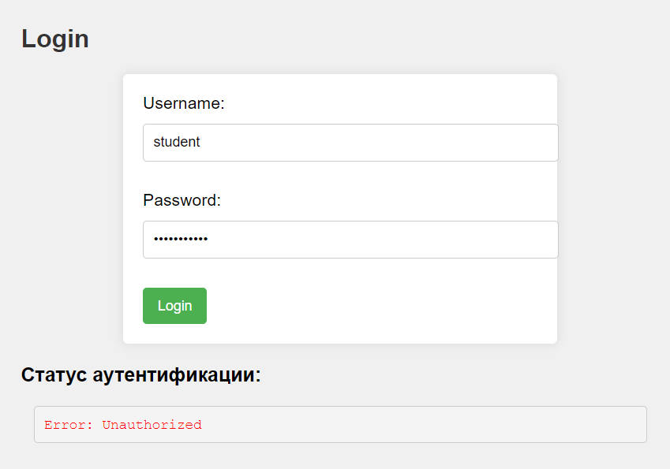

4. Analizam cererile care au fost trimise către server.
> 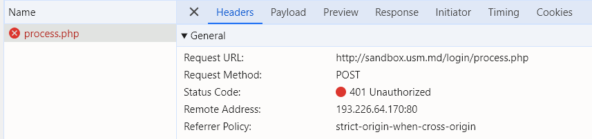

5. Răspundem la întrebările de mai jos:
a. Ce metodă HTTP a fost utilizată pentru a trimite cererea?
A fost utilizata metoda POST.
> 

b. Ce anteturi au fost trimise în cerere?
Anteturile trimise:
> 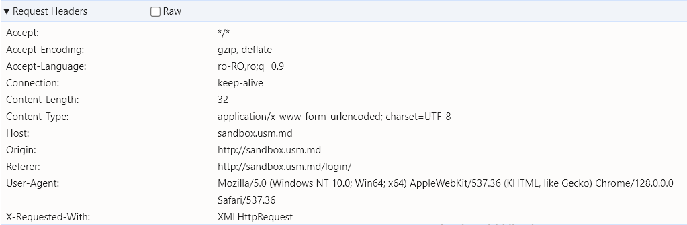

c. Ce parametri au fost trimiși în cerere?
> 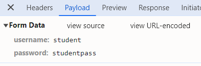

d. Ce cod de stare a fost returnat de server?
Starea de cod 401.
> 

e. Ce anteturi au fost trimise în răspuns?
Anteturile trimise sunt prezentate mai jos:
> 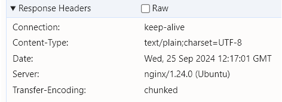

6. Repetăm pașii 3-5, introducând date corecte pentru autentificare (username: admin,
password: password).
Accesam site-ul si introducem datele corecte:
> 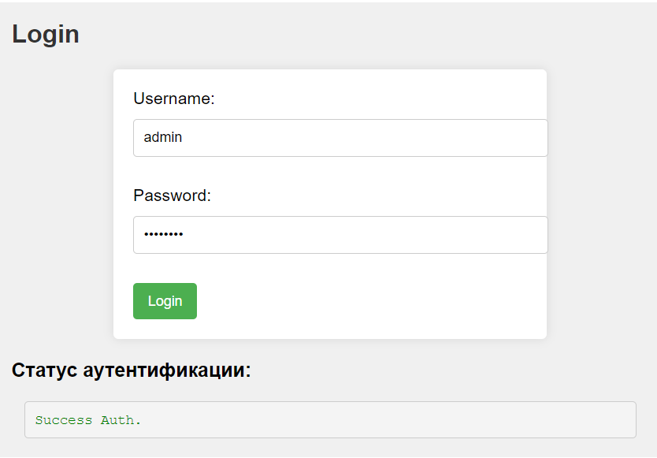

Analizam cererile care au fost trimise către server.
> 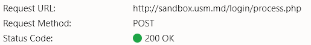

A fost folosită metoda POST:
> 

Anteturile trimise:
> 

Au fost trimiși în cerere parametrii:
> 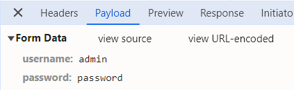

Starea de cod returnată este 200:
> 

În răspuns au fost trimise anteturile:
> 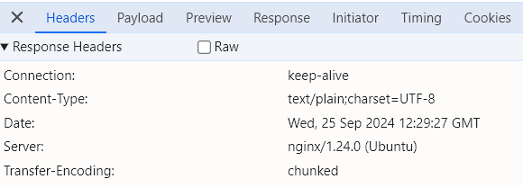


### Sarcina nr. 2. Crearea cererilor HTTP
1. Scrieți o cerere de tip GET către server la adresa http://sandbox.com, indicând în
antetul User-Agent numele și prenumele dvs.
```js
// Cererea GET folosind fetch
    fetch('http://sandbox.com', {
        method: 'GET',
        headers: {
          'User-Agent': 'Suletea Corina'
        }
    })
```
2. Scrieți o cerere de tip POST către server la adresa http://sandbox.com/cars, indicând
în corpul cererii următorii parametri:
-- make: Toyota
-- model: Corolla
-- year: 2020

```js
// Cererea POST folosind fetch
    fetch('http://sandbox.com/cars', {
        method: 'POST',
        headers: {
            'Content-Type': 'application/x-www-form-urlencoded'
        },
        body: new URLSearchParams({
            'make': 'Toyota',
            'model': 'Corolla',
            'year': '2020'
        })
    })
```

3. Scrieți o cerere de tip PUT către server la adresa http://sandbox.com/cars/1, indicând
în antetul User-Agent numele și prenumele dvs., în antetul Content-Type valoarea
application/json, iar în corpul cererii următorii parametri: json { "make": "Toyota",
"model": "Corolla", "year": 2021 }
```js
// Cererea PUT 
    fetch('http://sandbox.com/cars/1', {
        method: 'PUT',
        headers: {
            'Content-Type': 'application/json', // Tipul de continut: JSON
            'User-Agent': 'Suletea Corina' // Antetul User-Agent
        },
        body: JSON.stringify({ 
        // Trimitem corpului cererii in JSON
            'make': 'Toyota',
            'model': 'Corolla',
            'year': 2021
        })
    })
```

4. Scrieți unul dintre posibilele răspunsuri ale serverului la cererea anterioară. http POST
/cars HTTP/1.1 Host: sandbox.com Content-Type: application/json User-Agent: John
Doe model=Corolla&make=Toyota&year=2020 Presupuneți situațiile în care serverul
poate returna codurile de stare HTTP 200, 201, 400, 401, 403, 404, 500.

```js
// Cererea PUT 
    fetch('http://sandbox.com/cars/1', {
        method: 'PUT',
        headers: {
            'Content-Type': 'application/json', // Tipul de continut: JSON
            'User-Agent': 'Suletea Corina' // Antetul User-Agent
        },
        body: JSON.stringify({ 
        // Trimitem corpului cererii in JSON
            'make': 'Toyota',
            'model': 'Corolla',
            'year': 2021
        })
    })
    .then(response => {
    // Tratam raspunsurile pentru diferite coduri de stare
    switch(response.status) {
        case 200:
            console.log('Cod 200: OK - Resursa procesata cu succes!');
            break;
        case 201:
            console.log('Cod 201: Created - Resursa creata cu succes!');
            break;
        case 400:
            console.log('Cod 400: Bad Request - Cererea invalida sau date incorecte.');
            break;
        case 401:
            console.log('Cod 401: Unauthorized - Esti neautorizat pentru a accesare.');
            break;
        case 403:
            console.log('Cod 403: Forbidden - Acces la resursa interzis.');
            break;
        case 404:
            console.log('Cod 404: Not Found - Resursa solicitata nu a fost gasita.');
            break;
        case 500:
            console.log('Cod 500: Internal Server Error - A apărut o eroare internă pe server.');
            break;
        default:
            console.log('Cod necunoscut: ' + response.status);
        }
    return response.json(); // Raspuns in JSON 
    })
    .then(data => {
        console.log('Raspuns de la server:', data); // Afisam raspunsul de la server
    })
    .catch(error => {
        console.error('Error', error);
    });
```

5. Scrieți o cerere de tip DELETE la alegerea dvs. și să explicați de ce, în acest caz, este potrivit să utilizați metoda DELETE.

```js
// Cererea DELETE folosind fetch
    fetch('http://sandbox.com/cars/1', {
    method: 'DELETE',
    headers: {
        'User-Agent': 'John Doe', // Antetul User-Agent specificat
        'Content-Type': 'application/json' // Antetul Content-Type
        }
    })
```


### Sarcina nr. 3. Sarcina suplimentară. HTTP_Quest
1. Trimiteți o cerere de tip POST către server la adresa http://sandbox.usm.md/quest,
indicând în antetul User-Agent numele și prenumele dvs. (De exemplu, User-Agent:
John Doe). http POST /quest HTTP/1.1 Host: sandbox.usm.md User-Agent: John Doe
curl: bash curl -X POST http://sandbox.usm.md/quest -H "User-Agent: John Doe".
> 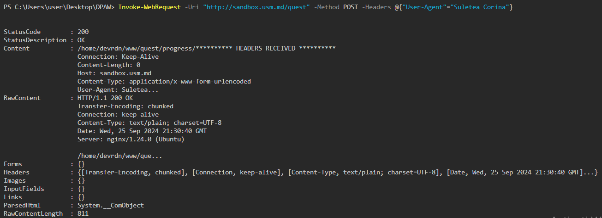

### Intrebări de autoevaluare
**1. Ce este protocolul HTTP?**
- HTTP este un protocol de comunicație utilizat pentru transferul de informații între un
client, de obicei un browser și un server web.

**2. Pentru ce folosim antetul User-Agent?**
- Antetul User-Agent identifică clientul care face cererea, oferind informații despre
browser și sistemul de operare, ajutând serverul să adapteze răspunsurile.

**3. Care este diferența dintre metodele PUT și PATCH?**
- Metoda PUT: Întreaga resursă este înlocuită pe server; se trimite o copie completă a
resursei.
- Metoda PATCH: Se aplică modificări parțiale, se trimit doar datele care trebuie
actualizate.
